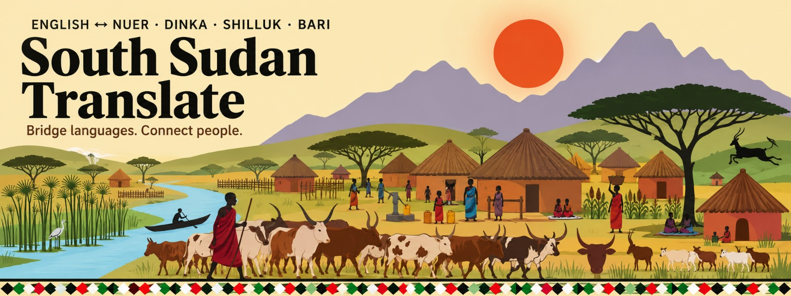

# Naath Dayom — The Living Library of Thok Nath

> An independent, open-source, interactive 3D library for the **Thok Nath** (Nuer) language. Eight volumes of vocabulary, grammar, structures, and conversation live on a continuous 3D shelf. Pull any book forward to inspect it. Open it to read.



---

## What This Is

**Naath Dayom** is a browser-based language preservation tool. It presents a curated, source-verified corpus of Thok Nath (Nuer) as a tactile 3D bookshelf. Every volume is a real data collection drawn from primary sources — not generated or invented.

The project is built as a **single self-contained HTML file** with no build step, no bundler, and no server required.

---

## The Eight Volumes

| Vol | Title | Contents | Type |
|-----|-------|----------|------|
| I | **Naath Dayom** | Welcome, project overview, how to browse | Welcome |
| II | **Core Dictionary** | 90+ dictionary entries (Nuer ↔ English) | Searchable list |
| III | **Vocabulary Atlas** | 24 themed groups: animals, numbers, colors, food, family, professions, etc. | Tabbed groups |
| IV | **Sentence Structures** | 50+ grammar pattern groups: tenses, pronouns, prepositions, questions, conditionals | Tabbed groups |
| V | **Grammar Patterns** | Tense rules with Nuer/English sentence pairs and explicit grammar explanations | Tabbed groups |
| VI | **Conversation** | 19 real-world dialogue sets: greetings, hotel, hospital, shopping, directions, restaurant, phone calls | Tabbed groups |
| VII | **Examples & Phrases** | Curated sentence examples: Bible verses, narratives, emotions, directions, wishes | Tabbed groups |
| VIII | **Grammar Rules** | 30+ compiled rule chapters: writing system, pronouns, negation, possession, numbers, conditionals, fixed expressions | Chapter reader |

---

## Features

- **3D Shelf** — Eight books sit on a continuous wooden shelf rendered in Three.js. All books are always visible.
- **Click to Inspect** — Click any book cover to pull it forward. The camera glides in. Orbit, zoom, and pan freely.
- **Click to Read** — Click the cover again (or the "Open volume" button) to open the book. Pages fan open with a 3D hinge animation.
- **Arrow Navigation** — Use ← → arrow keys (or the on-screen arrows) to move between books. Works in **browse**, **inspect**, and **reading** modes.
- **Dot Bar** — Click the bottom pill-bar to jump directly to any volume.
- **Search** — The Dictionary volume has live search filtering.
- **Responsive** — Adapts to desktop, tablet, and mobile. On small screens the detail panel becomes a bottom sheet.
- **Reduced Motion** — Respects `prefers-reduced-motion` for faster, simpler transitions.
- **Keyboard Accessible** — Full keyboard control: arrows, Enter, Escape, Home, End.
- **Screen Reader Support** — ARIA live regions announce state changes.

---

## Controls

| Input | Action |
|-------|--------|
| `←` `→` | Select previous / next book |
| `Enter` / `Space` | Open the selected book |
| `Esc` | Close book → return to shelf |
| `Home` | Jump to first book |
| `End` | Jump to last book |
| **Click cover** | Inspect the book |
| **Click cover again** | Open the book |
| **Drag on open pages** | Turn pages |
| **Right-drag** | Orbit camera |
| **Scroll** | Zoom camera |

---

## Architecture

### Single-File Design
Everything lives in one HTML file:

```
the_dayom_naath_living_library.html   ← 200+ KB, self-contained
logo.png                              ← Favicon
```

No build step. No `npm install`. Open the file in any modern browser.

### Tech Stack

| Layer | Technology |
|-------|------------|
| 3D Engine | [Three.js](https://threejs.org/) v0.160.0 (via CDN) |
| Controls | OrbitControls (Three.js addon) |
| Styling | Vanilla CSS with CSS custom properties |
| Fonts | Fraunces, Source Serif 4, Inter (Google Fonts) |
| Data | Inline JSON (`NAATH_DATA`) — no external API calls |

### State Machine

The app uses a strict 6-state machine:

```
BROWSE         → All books on shelf, active book slightly forward
OPENING        → Camera glides to selected book
INSPECT_CLOSED → Book pulled forward, cover cracks on hover
READING        → Book opens, pages visible, navigation hidden
CLOSING        → Camera returns to shelf
SHELF_RETURN   → Transition complete, back to BROWSE
```

### Key Classes

- **`ShelfEngine`** — Main Three.js scene manager. Handles rendering, raycasting, camera animation, state transitions, and book posing.
- **`Page`** — Segmented page geometry with vertex-shader-like bend deformation for page-turning.
- **Procedural Textures** — Cover cloth, paper grain, wood grain, page edges, and foil accents are all generated at runtime via `<canvas>`.
- **Cover Art** — Each book gets a unique front cover, spine, and back cover drawn procedurally with motifs (sun, ledger, grid, zigzag, rings, crescents, bracket, ladder).

---

## Data Structure

All language data is stored in the `NAATH_DATA` object with this schema:

```javascript
NAATH_DATA = {
  dictionary:     [{ nuer: "...", english: "...", pos: "..." }],
  vocabulary:     [{ group: "...", items: [{nuer, english}] }],
  structures:     [{ group: "...", items: [{nuer, english}] }],
  grammar:        [{ group: "...", items: [{nuer, english}] }],
  conversation:   [{ group: "...", items: [{nuer, english}] }],
  examples:       [{ group: "...", items: [{nuer, english, pattern}] }],
  grammar_rules:  [{ title: "...", intro: "...", pairs: [{nuer, english}] }],
  about:          [{ title: "...", text: "..." }]
}
```

The `BOOKS` array maps each volume to its data key, cover color, motif, and dimensions.

---

## Data Sources

This project draws from verified, primary sources. No words or sentences are invented.

| Source | Description |
|--------|-------------|
| **Nuer Bible** (RUAC KUƆTH IN RƐL RƆ) | 31,000+ verse pairs — primary source for complex grammar, narrative tense, and vocabulary |
| **Ethio Language Box** | Formal grammar rules, structural patterns, conversation dialogues, and vocabulary lists |
| **African Storybook Project** | 700+ narrative sentences demonstrating naturalistic usage |

---

## How to Run

### Option 1: Direct Open
Double-click `the_dayom_naath_living_library.html` in any modern browser (Chrome, Firefox, Safari, Edge).

### Option 2: Local Server (recommended for full functionality)
```bash
# Python 3
python -m http.server 8000

# Node.js
npx serve .

# Then open http://localhost:8000
```

### Option 3: Deploy
Upload both files to any static host (GitHub Pages, Netlify, Vercel, Cloudflare Pages):
```
the_dayom_naath_living_library.html
logo.png
```

---

## Customization

### Change a book's color
Edit the `cover` hex in the `BOOKS` array:

```javascript
{ id: "dictionary", cover: "#a85a3e", accent: "#e8dcc0", ... }
```

### Add vocabulary
Append to `NAATH_DATA.vocabulary`:

```javascript
{ group: "New Category", items: [
  { nuer: "...", english: "..." }
]}
```

### Change fonts
Update the Google Fonts `<link>` and the CSS `--font` references.

### Adjust shelf layout
Modify `SHELF.gap`, `SHELF.top`, or book `thickness`/`height`/`width` values.

---

## Browser Support

| Browser | Status |
|---------|--------|
| Chrome 90+ | ✓ Full support |
| Firefox 88+ | ✓ Full support |
| Safari 14+ | ✓ Full support |
| Edge 90+ | ✓ Full support |
| Mobile Chrome | ✓ Full support |
| Mobile Safari | ✓ Full support |

Requires WebGL 2.0 and ES modules.

---

## Performance Notes

- Textures are generated at load time and cached.
- Pixel ratio is capped at 1.75 (1.5 on mobile) to save GPU memory.
- Fog and shadow mapping are enabled for depth but tuned for performance.
- The entire scene runs at 60fps on mid-range devices.

---

## Credits

- **Concept & Development** — Naath community language preservation initiative
- **3D Engine** — Three.js by Ricardo Cabello and contributors
- **Typography** — Fraunces by Undercase Type, Source Serif 4 by Frank Grießhammer, Inter by Rasmus Andersson
- **Corpus Sources** — Nuer Bible, Ethio Language Box, African Storybook Project

---

## License

This is an independent open-source project. The Thok Nath corpus is provided for educational and preservation purposes. All source data is drawn from publicly available language learning materials.

---

> *"Naath Dayom — The Living Library of Thok Nath. Source-verified corpus."*
